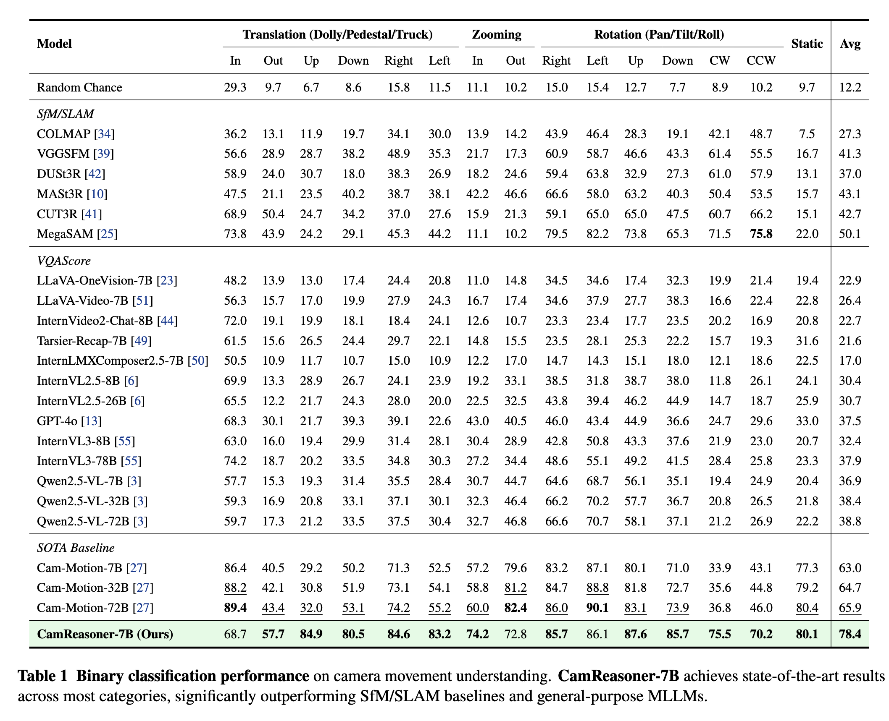
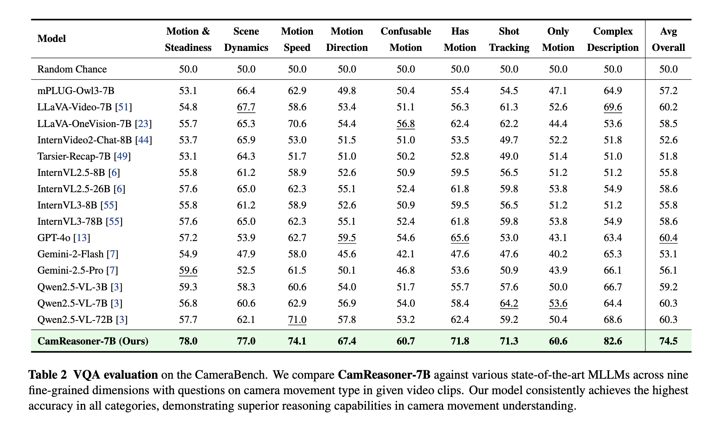
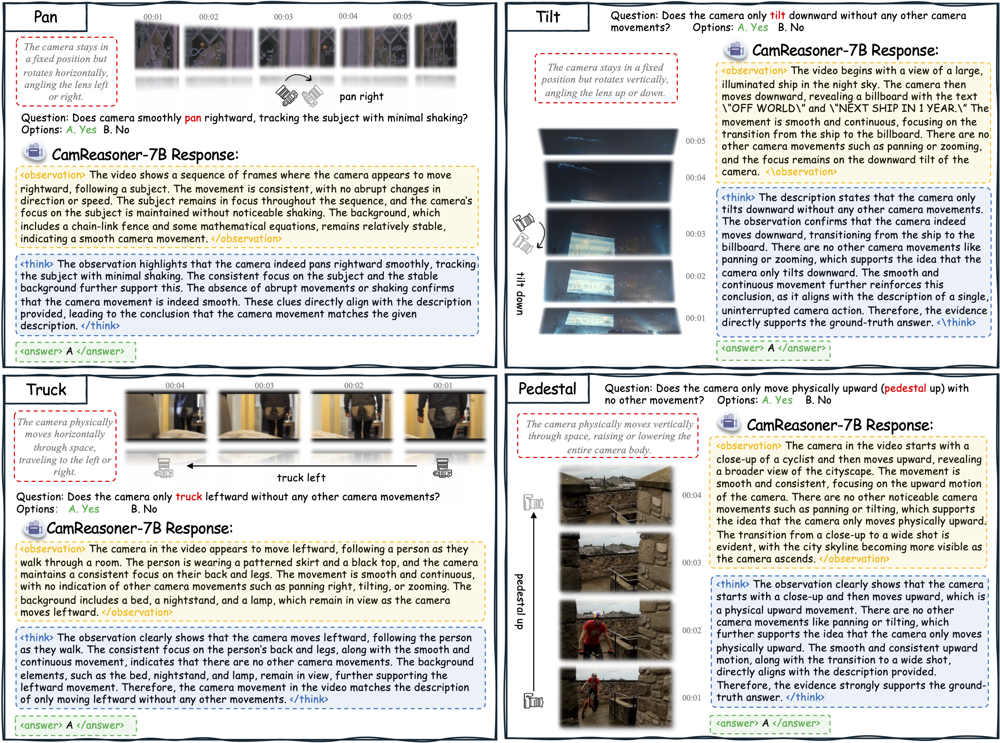

<p align="center" width="100%">
<!-- <a target="_blank"></a>
</p> -->

<div align="center">

# CamReasoner: Reinforcing Camera Movement Understanding via Structured Spatial Reasoning

</div>


<div align="center">
    
</div>


<div align="center">
<div class="is-size-5 publication-authors" style="font-size: 18px;">
    <span class="author-block">
      <a href="https://wuhang03.github.io/" target="_blank">Hang Wu</a><sup>1</sup>
    </span>
    &nbsp;&nbsp;&nbsp;&nbsp;
    <span class="author-block">
      <a href="https://vanoracai.github.io/" target="_blank">Yujun Cai</a><sup>†2,5</sup>
    </span>
    &nbsp;&nbsp;&nbsp;&nbsp;
    <span class="author-block">
      <a href="https://alphagolzh.github.io/" target="_blank">Zehao Li</a><sup>4</sup>
    </span>
    &nbsp;&nbsp;&nbsp;&nbsp;
    <span class="author-block">
      <a href="https://haonan-ge.github.io/" target="_blank">Haonan Ge</a><sup>1</sup>
    </span>
    &nbsp;&nbsp;&nbsp;&nbsp;
    <span class="author-block">
      <a href="https://scholar.google.com/citations?user=YsAEFj0AAAAJ" target="_blank">Bowen Sun</a><sup>1</sup>
    </span>
    <br>
    <span class="author-block">
      <a href="https://cse.buffalo.edu/~jsyuan/" target="_blank">Junsong Yuan</a><sup>4</sup>
    </span>
    &nbsp;&nbsp;&nbsp;&nbsp;
    <span class="author-block">
      <a href="https://wangywust.github.io/" target="_blank"> Yiwei Wang</a><sup>1</sup>
    </span>
  </div>

  <div class="is-size-5 publication-authors" style="font-size: 18px;">
    <span class="author-block">
      <sup>1</sup>University of California, Merced
      &nbsp;&nbsp;&nbsp;&nbsp;
      <sup>2</sup>The University of Queensland
      &nbsp;&nbsp;&nbsp;&nbsp; 
      <br><sup>3</sup>Institute of Computing Technology, Chinese Academy of Sciences
      &nbsp;&nbsp;&nbsp;&nbsp;
      <br><sup>4</sup>University at Buffalo, State University of New York
      &nbsp;&nbsp;&nbsp;&nbsp;
      <sup>5</sup>Ant Group
    </span>
    <span class="eql-cntrb"><small><br><sup>†</sup>Indicates Corresponding Author</small></span>
  </div>
</div>


<div style='display: flex; gap: 0.25rem; justify-content: center; text-align: center;' align="center">
  <!-- <a href='LICENCE'></a> -->
  <!-- <a href='https://arxiv.org/abs/2507.00008'></a>
  <a href='https://www.techrxiv.org/users/933923/articles/1304524-dimo-gui-advancing-test-time-scaling-in-gui-grounding-via-modality-aware-visual-reasoning'></a>
  <a href='https://wuhang03.github.io/DiMo-GUI-homepage/'></a> -->
  <!-- <a href='https://twitter.com/Leon_L_S_C'></a> -->
</div>

## 🔥 Update
<!-- * [2024-04-05]: ⭐️⭐️⭐️ VCD is selected as Poster Highlight in CVPR 2024! (Top 11.9% in accepted papers)
* [2023-11-29]: ⭐️ Paper of VCD online. Check out [this link](https://arxiv.org/abs/2311.16922) for details. -->


* [2026-01-28]: 🚀 [CamReasoner-7B](https://huggingface.co/LaurentWu/CamReasoner-7B) released on Huggingface.
* [2026-01-28]: 🚀 Codes and training dataset released.

## 🎯 Overview
<div align="center">
    
</div>

Abstract: Understanding camera dynamics is a fundamental pillar of video spatial intelligence. However, existing multimodal models predominantly treat this task as a black-box classification, often confusing physically distinct motions by relying on superficial visual patterns rather than geometric cues. We present **CamReasoner**, a framework that reformulates camera movement understanding as a structured inference process to bridge the gap between perception and cinematic logic. Our approach centers on the Observation-Thinking-Answer (O-T-A) paradigm, which compels the model to decode spatio-temporal cues such as trajectories and view frustums within an explicit reasoning block. To instill this capability, we construct a Large-scale Inference Trajectory Suite comprising 18k SFT reasoning chains and 38k RL feedback samples. Notably, we are the **first to employ RL for logical alignment in this domain**, ensuring motion inferences are grounded in physical geometry rather than contextual guesswork. By penalizing hallucinations and enforcing consistency through task-specific rewards, CamReasoner achieves state-of-the-art performance across multiple tasks. All datasets and models will be open-sourced.


## 🕹️ Usage

### Supervised Fine-tuning

Supervised Fine-Tuning establishes a foundational reasoning baseline by injecting structured templates and domain-specific knowledge, enabling the model to follow instructions and generate coherent initial responses.

```bash
git clone https://github.com/wuhang03/CamReasoner
cd CamReasoner

# build SFT environment
conda create -n sft python=3.11 
conda activate sft
cd LLaMA-Factory
bash setup.sh

# download data
bash download.sh

# run sft (modify parameters according to your need)
bash local_scripts/run_sft.sh
```

Our proposed SFT dataset **CamReasoning-SFT-18k** is in [camerabench_sft.json](LLaMA-Factory/data/camerabench_sft.json)

### Reinforcement Learning

Reinforcement Learning drives the model to self-evolve through trial and error, refining the internal logic chain and optimizing decision-making performance beyond the limitations of static training data.

```bash
git clone https://github.com/wuhang03/CamReasoner
cd CamReasoner

# build RL environment
conda create -n rl python=3.11 
conda activate rl
cd EasyR1
bash setup.sh

# download data
bash download.sh

# run rl (modify parameters according to your need)
bash local_scripts/run_rl.sh
```

Our proposed RL dataset **CamReasoning-RL-38k** is in [camerabench_rl.json](EasyR1/camerabench_rl.json)


For more details for the SFT and RL environment installation, please refer to [LLaMA-Factory](https://github.com/hiyouga/LLaMA-Factory),  [EasyR1](https://github.com/hiyouga/EasyR1)

### Evaluation

You can use CamReasoner-7B to inference and reproduce experimental results following this part.

```bash
git clone https://github.com/wuhang03/CamReasoner
cd CamReasoner

# build RL environment
conda create -n eval python=3.11 
conda activate eval
cd Evaluation
bash setup.sh

# download data
python data_download.py

# run rl (modify parameters according to your need)
bash eval/eval.sh
```

## 🏅 Experiments

<div align="center">
    
</div>

<div align="center">
    
</div>


- **Please refer to [our paper]() for detailed experimental results.**

## 📌 Examples

<div align="center">
    
</div>

**Qualitative results** across four typical camera movements. For each case, we visualize the temporal frame sequence alongside the CamReasoner-7B response. The model demonstrates robust spatial reasoning by generating detailed *<observation>* of visual cues and a logical *<think>* process to accurately identify the movement and provide the final *<answer>*.

## 📝 Acknowledgements

We sincerely appreciate the contributions of the open-source community. The related projects are as follows: 
* RL: [OneThinker](https://github.com/tulerfeng/OneThinker), [Video-R1](https://github.com/tulerfeng/Video-R1), [DeepSeek-R1](https://github.com/deepseek-ai/DeepSeek-R1),  [EasyR1](https://github.com/hiyouga/EasyR1), [verl](https://github.com/volcengine/verl)
* SFT: [LLaMA-Factory](https://github.com/hiyouga/LLaMA-Factory)
* Evaluation: [CameraBench](https://github.com/sy77777en/CameraBench), [VLMEvalKit](https://github.com/open-compass/VLMEvalKit)


<!-- Then, download the training datasets [[🤗 OneThinker-train-data](https://huggingface.co/datasets/OneThink/OneThinker-train-data)] and unzip all the data.

The `onethinker_rl_train.json` file is for RL training while `onethinker_sft_image.json` and `onethinker_sft_video.json` is for SFT cold start. The json files end with `_unsampled` are unsampled full set. -->


<!-- ## 🕹️ Usage
### Environment Setup
```bash
conda env create -n dimo-gui
source activate dimo-gui
cd DiMo-GUI
pip install -r requirements.txt
```


Note that the transformers version required by osatlas-4b is different from others, you need to run the following command to run osatlas-4b:
```bash
pip install transformers==4.37.2
```


### Data Preparation
You can download the **ScreenSpot-Pro** dataset from this huggingface [link](https://huggingface.co/datasets/likaixin/ScreenSpot-Pro), or use the download code below:

```bash
huggingface-cli download --resume-download  --repo-type dataset likaixin/ScreenSpot-Pro --local-dir ./data/pro
```

You can obtain the **ScreenSpot-V2** dataset from this [link](https://huggingface.co/datasets/likaixin/ScreenSpot-v2-variants), and refer to this [issue](https://github.com/likaixin2000/ScreenSpot-Pro-GUI-Grounding/issues/6)

Make sure you put the data under `./data` path, or you may need to change the bash script.

### Run DiMo-GUI

Use the shell script to run DiMo-GUI:
```bash
bash run_ss_pro.sh
bash run_ss_v2.sh
```

You can change the parameters like `models` and `max_iter` to run different experiments.

We provide the json file of experimental results in the paper in `results` folder.

## 🏅 Experiments
- **Comparison of various models on ScreenSpot-Pro.**
<div align="center">
    
</div>

- **Comparison of various models on ScreenSpot-V2**
<div align="center">
    
</div>


- **Please refer to [our paper]() for detailed experimental results.**


## 📌 Examples
<div align="center">
    
</div>

- **Examples on ScreenSpot-Pro.** On the left is the original model's prediction, where the red box represents the ground truth and the blue dot indicates the predicted coordinates. On the right is the result after integrating DiMo-GUI, where the model is able to localize more accurately according to the instruction


<div align="center">
    
</div>

- **Examples on ScreenSpot-V2.** On the Screenspot benchmark, which features relatively low resolution and simple scenes, DiMo-GUI also enhances the model's localization capabilities.


## 📑 Citation
If you find our project useful, we hope you can star our repo and cite our paper as follows:
```
@article{wu2025dimo,
  title={DiMo-GUI: Advancing Test-time Scaling in GUI Grounding via Modality-Aware Visual Reasoning},
  author={Wu, Hang and Chen, Hongkai and Cai, Yujun and Liu, Chang and Ye, Qingwen and Yang, Ming-Hsuan and Wang, Yiwei},
  year={2025}
}
```


## 📝 Related Projects
Our repository is based on the following projects, we sincerely thank them for their great efforts and excellent work.
- [ScreenSpot-Pro](https://github.com/likaixin2000/ScreenSpot-Pro-GUI-Grounding): latest GUI grounding benchmark.
- [Iterative-Narrowing](https://github.com/ant-8/GUI-Grounding-via-Iterative-Narrowing): Iterative Narrowing for GUI grounding.
- [OS-Atlas](https://github.com/OS-Copilot/OS-Atlas) , [UGround](https://github.com/OSU-NLP-Group/UGround): SOTA GUI agents.

## License

This project is licensed under the terms of the Apache License 2.0.
You are free to use, modify, and distribute this software under the conditions of the license. See the LICENSE file for details. -->
